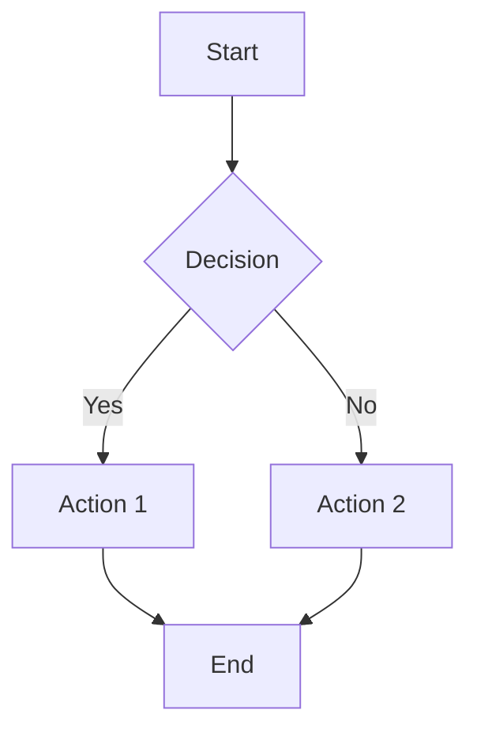
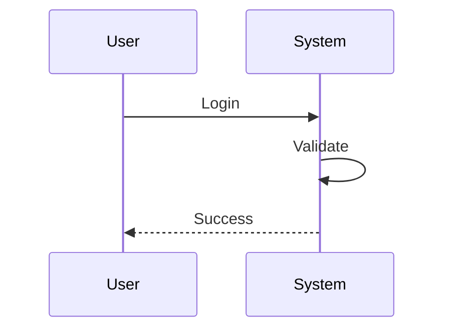
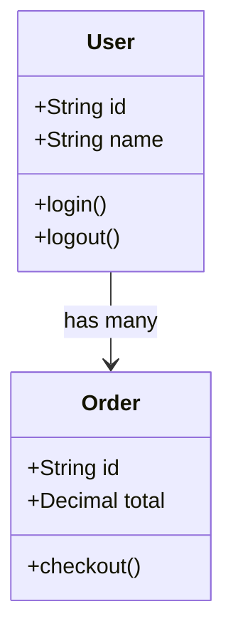
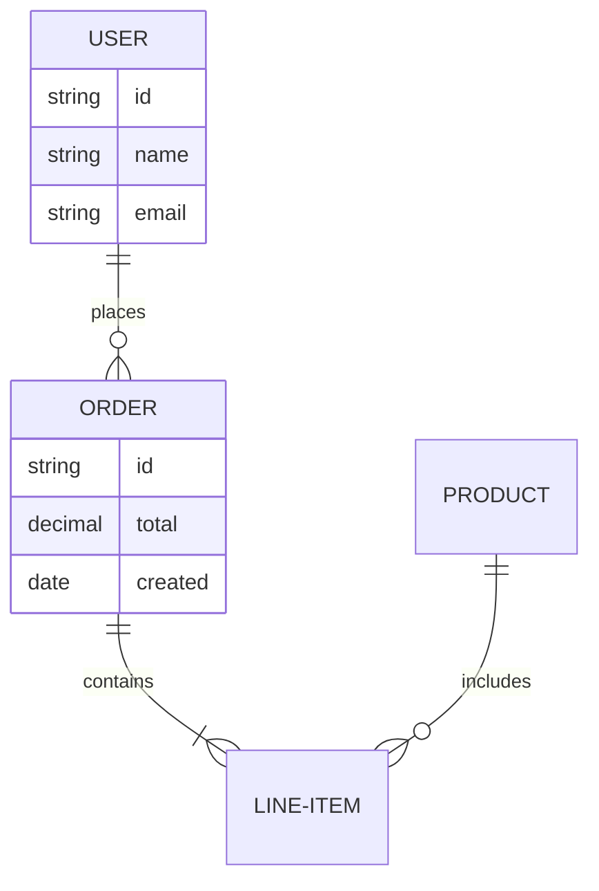
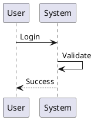
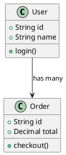

# AI-ley Tools Model - Quick Reference

## CLI Commands

### generate

Generate diagrams from various inputs.

```bash
npm run generate -- <input> [options]
```

**Options:**
- `-t, --type <type>` - Diagram type (flowchart, sequence, class, er, gantt, state, pie, mindmap, timeline, sankey)
- `-f, --format <format>` - Output format (mermaid, plantuml)
- `-o, --output <file>` - Output file path
- `--theme <theme>` - Theme (default, dark, forest, neutral)
- `--template <name>` - Use template from library
- `--nl` - Natural language input mode
- `--data <file>` - Data file (JSON, YAML, CSV)

**Examples:**

```bash
# Natural language
npm run generate -- "User login flow" --type sequence --nl

# From JSON
npm run generate -- ./data.json --type class --output class.mmd

# From template
npm run generate -- --template flowchart-basic --data ./data.json
```

### convert

Convert between Mermaid and PlantUML.

```bash
npm run convert -- <input> [options]
```

**Options:**
- `-o, --output <file>` - Output file path
- `-f, --format <format>` - Target format (mermaid, plantuml, auto)
- `--preserve-comments` - Preserve comments
- `--preserve-formatting` - Preserve formatting

**Examples:**

```bash
# Mermaid to PlantUML
npm run convert -- diagram.mmd --format plantuml

# Auto-detect
npm run convert -- input-file --output output-file
```

### parse

Parse and analyze diagrams.

```bash
npm run parse -- <input> [options]
```

**Options:**
- `--analyze` - Complexity analysis
- `--extract` - Extract metadata
- `--ast` - Output AST
- `-o, --output <file>` - Save to file

**Examples:**

```bash
# Syntax validation
npm run parse -- diagram.mmd

# Complexity analysis
npm run parse -- diagram.mmd --analyze
```

### render

Render to images via API.

```bash
npm run render -- <input> [options]
```

**Options:**
- `-f, --format <format>` - Output format (svg, png, pdf)
- `-o, --output <file>` - Output file
- `--api <api>` - API (mermaid-ink, plantuml-server, auto)
- `--theme <theme>` - Theme

**Examples:**

```bash
# Render Mermaid to SVG
npm run render -- diagram.mmd --format svg --output diagram.svg

# Render PlantUML to PNG
npm run render -- diagram.puml --format png
```

### validate

Validate diagram syntax.

```bash
npm run validate -- <input> [options]
```

**Options:**
- `--strict` - Strict mode
- `--max-complexity <n>` - Max complexity
- `-o, --output <file>` - Save report

**Examples:**

```bash
# Basic validation
npm run validate -- diagram.mmd

# Strict with complexity check
npm run validate -- diagram.mmd --strict --max-complexity 100
```

### template

Manage templates.

```bash
npm run template -- <command> [options]
```

**Commands:**
- `list` - List templates
- `use <name>` - Use template
- `create <name>` - Create template
- `delete <name>` - Delete template

**Examples:**

```bash
# List templates
npm run template -- list

# Use template
npm run template -- use sequence-auth --data ./data.json

# Create template
npm run template -- create my-template --input template.mmd
```

### batch

Process multiple diagrams.

```bash
npm run batch -- <pattern> [options]
```

**Options:**
- `--convert <format>` - Convert to format
- `--render <format>` - Render to format
- `--validate` - Validate all
- `-o, --output <dir>` - Output directory
- `--concurrency <n>` - Parallel processing

**Examples:**

```bash
# Convert all Mermaid to PlantUML
npm run batch -- ./diagrams/*.mmd --convert plantuml

# Render all to SVG
npm run batch -- ./diagrams/* --render svg
```

## TypeScript API

### Generation

```typescript
// Natural language
const diagram = await client.generate.fromNaturalLanguage(
  'E-commerce checkout flow',
  { type: 'flowchart', format: 'mermaid' }
);

// From JSON
const jsonData = {
  classes: [
    { name: 'User', properties: ['id', 'name'], methods: ['login'] }
  ]
};
const classDiagram = await client.generate.fromJSON(jsonData, {
  type: 'class',
  format: 'plantuml'
});

// From YAML
const flowchart = await client.generate.fromYAML('./workflow.yaml', {
  type: 'flowchart'
});

// From CSV
const erDiagram = await client.generate.fromCSV('./schema.csv', {
  type: 'er'
});

// From template
const diagram = await client.generate.fromTemplate('sequence-auth', {
  data: { serviceName: 'UserService' }
});
```

### Conversion

```typescript
// Mermaid to PlantUML
const plantuml = await client.convert.mermaidToPlantUML(mermaidCode);

// PlantUML to Mermaid
const mermaid = await client.convert.plantUMLToMermaid(plantumlCode);

// Auto-detect
const converted = await client.convert.auto(code);
```

### Validation & Analysis

```typescript
// Validate
const result = await client.validate(code);
if (!result.isValid) {
  console.error('Errors:', result.errors);
}

// Analyze complexity
const analysis = await client.analyze(code);
console.log(`Nodes: ${analysis.nodeCount}`);
console.log(`Complexity: ${analysis.complexity}`);
```

### Rendering

```typescript
// Render Mermaid
await client.render(mermaidCode, {
  format: 'svg',
  output: './diagram.svg',
  api: 'mermaid-ink'
});

// Get render URL
const url = await client.getRenderUrl(code, {
  format: 'svg'
});
```

### Templates

```typescript
// List templates
const templates = await client.template.list();

// Use template
const diagram = await client.template.use('sequence-auth', {
  serviceName: 'PaymentService'
});

// Create template
await client.template.create('my-template', templateCode);
```

### Batch Processing

```typescript
// Process multiple files
const results = await client.batch.process(['./diagrams/*.mmd'], {
  operation: 'convert',
  targetFormat: 'plantuml',
  outputDirectory: './output'
});

console.log(`Processed: ${results.successful}/${results.total}`);
```

## Diagram Examples

### Mermaid Flowchart



### Mermaid Sequence



### Mermaid Class



### Mermaid ER



### PlantUML Sequence



### PlantUML Class



## Environment Variables

| Variable                   | Description                     | Default                              |
| -------------------------- | ------------------------------- | ------------------------------------ |
| `ENABLE_API_RENDERING`     | Enable API rendering            | `false`                              |
| `MERMAID_INK_URL`          | Mermaid.ink API URL             | `https://mermaid.ink`                |
| `PLANTUML_SERVER_URL`      | PlantUML server URL             | `https://www.plantuml.com/plantuml`  |
| `DEFAULT_RENDER_FORMAT`    | Default render format           | `svg`                                |
| `DEFAULT_DIAGRAM_TYPE`     | Default diagram type            | `flowchart`                          |
| `DEFAULT_THEME`            | Default theme                   | `default`                            |
| `TEMPLATE_DIRECTORY`       | Template directory              | `./templates`                        |
| `OUTPUT_DIRECTORY`         | Output directory                | `./output`                           |
| `ENABLE_SYNTAX_VALIDATION` | Enable validation               | `true`                               |
| `MAX_DIAGRAM_COMPLEXITY`   | Max complexity                  | `1000`                               |
| `API_TIMEOUT`              | API timeout (ms)                | `10000`                              |
| `ENABLE_CACHE`             | Enable caching                  | `true`                               |
| `CACHE_TTL`                | Cache TTL (seconds)             | `3600`                               |

## Built-in Templates

| Template            | Type     | Description                |
| ------------------- | -------- | -------------------------- |
| flowchart-basic     | Mermaid  | Basic flowchart            |
| flowchart-decision  | Mermaid  | Decision flowchart         |
| sequence-auth       | Mermaid  | Authentication sequence    |
| sequence-api        | Mermaid  | API call sequence          |
| class-mvc           | Mermaid  | MVC architecture           |
| class-repository    | Mermaid  | Repository pattern         |
| er-ecommerce        | Mermaid  | E-commerce schema          |
| er-blog             | Mermaid  | Blog schema                |
| gantt-project       | Mermaid  | Project timeline           |
| state-workflow      | Mermaid  | Workflow state machine     |
| puml-sequence-basic | PlantUML | Basic sequence             |
| puml-class-basic    | PlantUML | Basic class                |

## Troubleshooting

| Issue                     | Solution                                              |
| ------------------------- | ----------------------------------------------------- |
| Invalid syntax error      | Run `npm run validate -- diagram.mmd`                 |
| API rendering fails       | Check internet, verify API URLs in .env              |
| Conversion errors         | Some features may not be compatible across formats   |
| Template not found        | Run `npm run template -- list`                        |
| Batch processing slow     | Reduce concurrency: `--concurrency 3`                 |
| VS Code preview not working | Install "Markdown Preview Mermaid Support" extension |

## Resources

- [Full Documentation](SKILL.md)
- [Mermaid Documentation](https://mermaid.js.org/)
- [PlantUML Documentation](https://plantuml.com/)
- [Mermaid.ink API](https://mermaid.ink/)
- [PlantUML Server](https://github.com/plantuml/plantuml-server)

---

version: 1.0.0
updated: 2026-02-01
reviewed: 2026-02-01
score: 4.6
---
