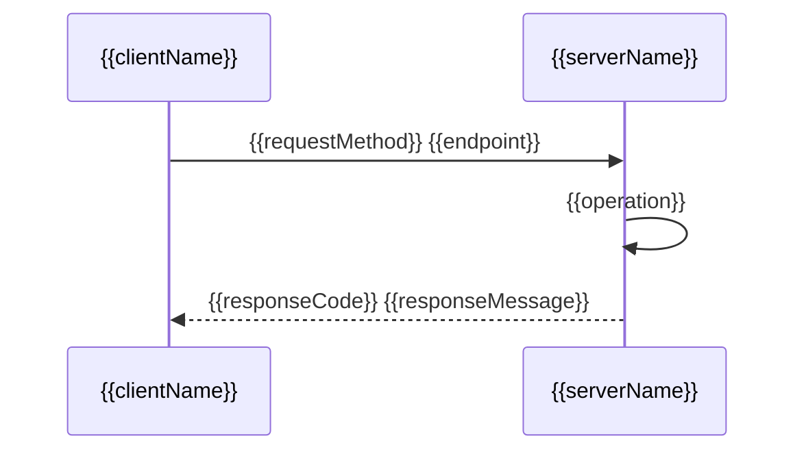

# AI-ley Tools Model

Comprehensive Mermaid and PlantUML diagram toolkit with generation, translation, parsing, and optional API-based rendering.

## Overview

The Tools Model skill provides:

- **Diagram Generation**: Create Mermaid/PlantUML from natural language, JSON, YAML, or data structures
- **Format Conversion**: Bidirectional Mermaid ↔ PlantUML translation
- **Parsing & Validation**: Syntax validation and complexity analysis
- **API Rendering** (Optional): Generate SVG/PNG/PDF via Mermaid.ink or PlantUML server
- **Template Library**: Pre-built patterns for common diagram types
- **VS Code Integration**: Leverage built-in Mermaid preview
- **Batch Processing**: Process multiple diagrams efficiently

## When to Use

- Creating diagrams from natural language descriptions
- Converting between Mermaid and PlantUML formats
- Generating diagrams from JSON/YAML data structures
- Validating diagram syntax and complexity
- Rendering diagrams to images via API (optional)
- Building visual documentation from code or data
- Batch processing diagram files

## Installation

```bash
cd .github/skills/ailey-tools-model
npm install
./install.sh
```

## Quick Start

### Generate Mermaid Flowchart from Natural Language

```bash
npm run generate -- "User login process with authentication and error handling" --type flowchart --output login.mmd
```

### Convert Mermaid to PlantUML

```bash
npm run convert -- input.mmd --output output.puml
```

### Render Diagram via API

```bash
npm run render -- diagram.mmd --format svg --output diagram.svg
```

### Validate Diagram Syntax

```bash
npm run validate -- diagram.mmd
```

## Setup Instructions

### Step 1: Install Dependencies

```bash
npm install
```

### Step 2: Configure Environment (Optional)

Copy `.env.example` to `.env` and configure:

```bash
cp .env.example .env
```

**For API Rendering (Optional):**

```env
# Enable API rendering
ENABLE_API_RENDERING=true

# Mermaid.ink API (no auth required)
MERMAID_INK_URL=https://mermaid.ink

# PlantUML Server API
PLANTUML_SERVER_URL=https://www.plantuml.com/plantuml

# Rendering format (svg, png, pdf)
DEFAULT_RENDER_FORMAT=svg
```

### Step 3: Build TypeScript

```bash
npm run build
```

### Step 4: Verify Installation

```bash
npm run diagnose
```

## AI-ley Configuration

Add to `.ai-ley/config/integrations.yaml`:

```yaml
tools-model:
  type: tools
  name: Mermaid & PlantUML Model Tools
  enabled: true
  config:
    # Generation
    defaultDiagramType: flowchart
    defaultTheme: default
    enableNlpGeneration: true
    
    # Rendering (optional)
    enableApiRendering: false
    mermaidInkUrl: https://mermaid.ink
    plantumlServerUrl: https://www.plantuml.com/plantuml
    defaultRenderFormat: svg
    
    # Conversion
    defaultConversionDirection: auto
    preserveComments: true
    preserveFormatting: true
    
    # Validation
    enableSyntaxValidation: true
    enableComplexityAnalysis: true
    maxDiagramComplexity: 1000
    
    # Templates
    templateDirectory: ./templates
    enableCustomTemplates: true
    
    # Output
    outputDirectory: ./output
    outputNamingPattern: "{name}.{format}"
    overwriteExisting: false
    
    # VS Code
    useVscodePreview: true
    openInVscode: false
```

## Features

### 1. Diagram Generation

Generate diagrams from various inputs:

**Natural Language:**

```bash
npm run generate -- "Create a sequence diagram for user registration with email verification" --type sequence
```

**JSON Data:**

```bash
npm run generate -- ./data.json --type class --output class-diagram.mmd
```

**YAML Data:**

```bash
npm run generate -- ./workflow.yaml --type flowchart --output workflow.mmd
```

**CSV Data (ER Diagram):**

```bash
npm run generate -- ./schema.csv --type er --output schema.mmd
```

### 2. Format Conversion

Bidirectional conversion between Mermaid and PlantUML:

**Mermaid → PlantUML:**

```bash
npm run convert -- diagram.mmd --output diagram.puml
```

**PlantUML → Mermaid:**

```bash
npm run convert -- diagram.puml --output diagram.mmd
```

**Auto-detect:**

```bash
npm run convert -- input-file --output output-file
```

### 3. Parsing & Validation

Validate syntax and analyze complexity:

**Syntax Validation:**

```bash
npm run validate -- diagram.mmd
# Output: ✅ Valid Mermaid syntax (12 nodes, 15 edges)
```

**Complexity Analysis:**

```bash
npm run parse -- diagram.mmd --analyze
# Output: Complexity: Medium (45 nodes, 67 edges, 3 levels deep)
```

### 4. API Rendering (Optional)

Render diagrams to images via external APIs:

**Mermaid.ink (Mermaid only):**

```bash
npm run render -- diagram.mmd --format svg --output diagram.svg
```

**PlantUML Server (PlantUML only):**

```bash
npm run render -- diagram.puml --format png --output diagram.png
```

**Supported Formats:**

- **SVG**: Scalable vector graphics (recommended)
- **PNG**: Raster image with transparency
- **PDF**: Portable document format

### 5. Template Library

Use pre-built templates for common patterns:

**List Available Templates:**

```bash
npm run template -- list
# Output: flowchart-basic, sequence-auth, class-mvc, er-ecommerce, gantt-project, ...
```

**Generate from Template:**

```bash
npm run template -- use flowchart-basic --data ./data.json --output flow.mmd
```

**Create Custom Template:**

```bash
npm run template -- create my-template --input template.mmd
```

### 6. Batch Processing

Process multiple diagrams efficiently:

```bash
npm run batch -- ./diagrams/*.mmd --convert plantuml --output ./output
```

**Batch Options:**

- `--convert <format>`: Convert to format (mermaid, plantuml)
- `--render <format>`: Render to image format (svg, png, pdf)
- `--validate`: Validate all diagrams
- `--concurrency <n>`: Parallel processing (default: 5)

## Diagram Types

### Mermaid Diagrams

| Type       | Description                       | Example Use Case               |
| ---------- | --------------------------------- | ------------------------------ |
| flowchart  | Flow diagrams with decision logic | Process flows, algorithms      |
| sequence   | Interaction sequences             | API calls, user flows          |
| class      | Class relationships               | Object-oriented design         |
| er         | Entity-relationship diagrams      | Database schema                |
| gantt      | Project timelines                 | Project planning               |
| state      | State machines                    | Application state, workflows   |
| pie        | Pie charts                        | Statistics, proportions        |
| mindmap    | Mind maps                         | Brainstorming, concepts        |
| timeline   | Event timelines                   | Historical events, roadmaps    |
| sankey     | Flow diagrams with quantities     | Data flow, resource allocation |
| gitgraph   | Git branch visualization          | Version control history        |
| quadrant   | Quadrant charts                   | Prioritization matrices        |

### PlantUML Diagrams

| Type         | Description                    | Example Use Case          |
| ------------ | ------------------------------ | ------------------------- |
| sequence     | Sequence diagrams              | API interactions          |
| usecase      | Use case diagrams              | Requirements analysis     |
| class        | Class diagrams                 | OOP design                |
| activity     | Activity diagrams              | Business processes        |
| component    | Component diagrams             | System architecture       |
| deployment   | Deployment diagrams            | Infrastructure            |
| state        | State diagrams                 | State machines            |
| object       | Object diagrams                | Object instances          |
| timing       | Timing diagrams                | Real-time systems         |
| network      | Network diagrams               | Network topology          |
| wireframe    | UI wireframes                  | Interface mockups         |
| archimate    | ArchiMate enterprise diagrams  | Enterprise architecture   |
| gantt        | Gantt charts                   | Project schedules         |
| mindmap      | Mind maps                      | Concept mapping           |
| wbs          | Work breakdown structure       | Project decomposition     |
| json         | JSON data visualization        | Data structure            |
| yaml         | YAML data visualization        | Configuration             |

## CLI Commands

### generate

Generate diagrams from various inputs.

```bash
npm run generate -- <input> [options]

Options:
  -t, --type <type>        Diagram type (flowchart, sequence, class, er, etc.)
  -o, --output <file>      Output file path
  -f, --format <format>    Output format (mermaid, plantuml)
  --theme <theme>          Theme (default, dark, forest, neutral)
  --data <file>            Data file for generation (JSON, YAML, CSV)
  --template <name>        Use template from library
  --nl                     Natural language input mode
```

**Examples:**

```bash
# Natural language
npm run generate -- "User registration flow with email verification" --type sequence --nl

# From JSON
npm run generate -- ./data.json --type class --output class.mmd

# Using template
npm run generate -- --template flowchart-basic --data ./data.json
```

### convert

Convert between Mermaid and PlantUML formats.

```bash
npm run convert -- <input> [options]

Options:
  -o, --output <file>      Output file path
  -f, --format <format>    Target format (mermaid, plantuml, auto)
  --preserve-comments      Preserve comments during conversion
  --preserve-formatting    Preserve formatting during conversion
```

**Examples:**

```bash
# Mermaid to PlantUML
npm run convert -- diagram.mmd --format plantuml --output diagram.puml

# PlantUML to Mermaid
npm run convert -- diagram.puml --format mermaid --output diagram.mmd

# Auto-detect
npm run convert -- input.mmd --output output.puml
```

### parse

Parse and analyze diagram syntax.

```bash
npm run parse -- <input> [options]

Options:
  --analyze                Perform complexity analysis
  --extract                Extract diagram metadata
  --ast                    Output abstract syntax tree
  -o, --output <file>      Save analysis to file (JSON)
```

**Examples:**

```bash
# Syntax validation
npm run parse -- diagram.mmd

# Complexity analysis
npm run parse -- diagram.mmd --analyze

# Extract metadata
npm run parse -- diagram.mmd --extract --output metadata.json
```

### render

Render diagrams to images via API (optional).

```bash
npm run render -- <input> [options]

Options:
  -f, --format <format>    Output format (svg, png, pdf)
  -o, --output <file>      Output file path
  --api <api>              API to use (mermaid-ink, plantuml-server)
  --theme <theme>          Diagram theme
```

**Examples:**

```bash
# Render Mermaid to SVG
npm run render -- diagram.mmd --format svg --output diagram.svg

# Render PlantUML to PNG
npm run render -- diagram.puml --format png --output diagram.png
```

### validate

Validate diagram syntax.

```bash
npm run validate -- <input> [options]

Options:
  --strict                 Strict validation mode
  --max-complexity <n>     Maximum allowed complexity
  -o, --output <file>      Save validation report
```

**Examples:**

```bash
# Basic validation
npm run validate -- diagram.mmd

# Strict validation with complexity check
npm run validate -- diagram.mmd --strict --max-complexity 100
```

### template

Manage diagram templates.

```bash
npm run template -- <command> [options]

Commands:
  list                     List available templates
  use <name>               Generate diagram from template
  create <name>            Create custom template
  delete <name>            Delete custom template

Options:
  --data <file>            Data file for template (JSON, YAML)
  -o, --output <file>      Output file path
```

**Examples:**

```bash
# List templates
npm run template -- list

# Use template
npm run template -- use sequence-auth --data ./auth-data.json --output auth.mmd

# Create custom template
npm run template -- create my-flowchart --input template.mmd
```

### batch

Process multiple diagrams.

```bash
npm run batch -- <pattern> [options]

Options:
  --convert <format>       Convert to format (mermaid, plantuml)
  --render <format>        Render to image format (svg, png, pdf)
  --validate               Validate all diagrams
  -o, --output <dir>       Output directory
  --concurrency <n>        Parallel processing (default: 5)
```

**Examples:**

```bash
# Convert all Mermaid to PlantUML
npm run batch -- ./diagrams/*.mmd --convert plantuml --output ./output

# Render all diagrams to SVG
npm run batch -- ./diagrams/* --render svg --output ./images

# Validate all diagrams
npm run batch -- ./diagrams/* --validate
```

### diagnose

System diagnostics and configuration check.

```bash
npm run diagnose
```

## TypeScript API

### Basic Usage

```typescript
import { ModelClient } from './index';

const client = new ModelClient({
  enableApiRendering: false,
  defaultTheme: 'default',
  outputDirectory: './output'
});

// Generate diagram from natural language
const mermaid = await client.generate.fromNaturalLanguage(
  'User login process with authentication',
  { type: 'sequence', format: 'mermaid' }
);
console.log(mermaid);

// Convert Mermaid to PlantUML
const plantuml = await client.convert.mermaidToPlantUML(mermaid);
console.log(plantuml);

// Validate syntax
const validation = await client.validate(mermaid);
console.log(validation.isValid); // true

// Render to image (optional)
await client.render(mermaid, {
  format: 'svg',
  output: './login-sequence.svg'
});
```

### Generation API

```typescript
// From natural language
const diagram = await client.generate.fromNaturalLanguage(
  'E-commerce checkout flow with payment gateway',
  { type: 'flowchart', format: 'mermaid', theme: 'default' }
);

// From JSON data
const jsonData = {
  classes: [
    { name: 'User', properties: ['id', 'name'], methods: ['login'] },
    { name: 'Order', properties: ['id', 'total'], methods: ['checkout'] }
  ],
  relationships: [
    { from: 'User', to: 'Order', type: 'has-many' }
  ]
};
const classDiagram = await client.generate.fromJSON(jsonData, {
  type: 'class',
  format: 'plantuml'
});

// From YAML data
const yamlData = `
steps:
  - name: Start
    next: Authentication
  - name: Authentication
    next: Dashboard
  - name: Dashboard
`;
const flowchart = await client.generate.fromYAML(yamlData, {
  type: 'flowchart',
  format: 'mermaid'
});

// From CSV (for ER diagrams)
const erDiagram = await client.generate.fromCSV('./schema.csv', {
  type: 'er',
  format: 'mermaid'
});

// From template
const diagram = await client.generate.fromTemplate('sequence-auth', {
  data: { serviceName: 'UserService', endpoint: '/login' }
});
```

### Conversion API

```typescript
// Mermaid to PlantUML
const plantuml = await client.convert.mermaidToPlantUML(mermaidCode, {
  preserveComments: true,
  preserveFormatting: true
});

// PlantUML to Mermaid
const mermaid = await client.convert.plantUMLToMermaid(plantumlCode, {
  preserveComments: true,
  preserveFormatting: true
});

// Auto-detect format
const converted = await client.convert.auto(diagramCode, {
  targetFormat: 'plantuml'
});
```

### Parsing API

```typescript
// Parse diagram
const ast = await client.parse(diagramCode);
console.log(ast);

// Validate syntax
const validation = await client.validate(diagramCode);
if (!validation.isValid) {
  console.error('Errors:', validation.errors);
}

// Complexity analysis
const analysis = await client.analyze(diagramCode);
console.log(`Nodes: ${analysis.nodeCount}`);
console.log(`Edges: ${analysis.edgeCount}`);
console.log(`Depth: ${analysis.maxDepth}`);
console.log(`Complexity: ${analysis.complexity}`); // low, medium, high
```

### Rendering API (Optional)

```typescript
// Render Mermaid via Mermaid.ink
await client.render(mermaidCode, {
  format: 'svg',
  output: './diagram.svg',
  api: 'mermaid-ink',
  theme: 'dark'
});

// Render PlantUML via PlantUML server
await client.render(plantumlCode, {
  format: 'png',
  output: './diagram.png',
  api: 'plantuml-server'
});

// Get render URL (without downloading)
const url = await client.getRenderUrl(mermaidCode, {
  format: 'svg',
  api: 'mermaid-ink'
});
console.log(`View at: ${url}`);
```

### Template API

```typescript
// List templates
const templates = await client.template.list();
console.log(templates); // ['flowchart-basic', 'sequence-auth', ...]

// Get template
const template = await client.template.get('sequence-auth');

// Generate from template
const diagram = await client.template.use('sequence-auth', {
  serviceName: 'PaymentService',
  operations: ['validateCard', 'processPayment', 'sendReceipt']
});

// Create custom template
await client.template.create('my-template', templateCode);

// Delete template
await client.template.delete('my-template');
```

### Batch Processing API

```typescript
// Process multiple files
const results = await client.batch.process(['./diagrams/*.mmd'], {
  operation: 'convert',
  targetFormat: 'plantuml',
  outputDirectory: './output',
  concurrency: 5
});

console.log(`Processed: ${results.successful}/${results.total}`);
if (results.failed.length > 0) {
  console.error('Failures:', results.failed);
}
```

### Event System

```typescript
// Listen for events
client.on('diagram-generated', (data) => {
  console.log(`Generated: ${data.type} (${data.lineCount} lines)`);
});

client.on('conversion-complete', (data) => {
  console.log(`Converted: ${data.from} → ${data.to}`);
});

client.on('validation-failed', (data) => {
  console.error(`Validation errors: ${data.errors.length}`);
});

client.on('render-complete', (data) => {
  console.log(`Rendered: ${data.format} (${data.size} bytes)`);
});

client.on('batch-progress', (data) => {
  console.log(`Progress: ${data.completed}/${data.total}`);
});
```

## Workflows

### Workflow 1: Generate Documentation from Code

Generate UML class diagrams from TypeScript/JavaScript code:

```bash
# Extract class structure to JSON
# (You would parse code to extract this data)
cat > classes.json << EOF
{
  "classes": [
    {
      "name": "UserService",
      "properties": ["users", "cache"],
      "methods": ["getUser", "createUser", "updateUser"]
    },
    {
      "name": "AuthService",
      "properties": ["tokens"],
      "methods": ["login", "logout", "refreshToken"]
    }
  ],
  "relationships": [
    { "from": "UserService", "to": "AuthService", "type": "depends-on" }
  ]
}
EOF

# Generate class diagram
npm run generate -- ./classes.json --type class --output architecture.mmd

# Render to SVG
npm run render -- architecture.mmd --format svg --output architecture.svg
```

### Workflow 2: Database Schema Documentation

Generate ER diagrams from database schema:

```bash
# Export schema to CSV
cat > schema.csv << EOF
table,column,type,relationship,references
users,id,primary_key,,
users,email,string,,
orders,id,primary_key,,
orders,user_id,foreign_key,many-to-one,users.id
orders,total,decimal,,
EOF

# Generate ER diagram
npm run generate -- ./schema.csv --type er --format mermaid --output schema.mmd

# Convert to PlantUML
npm run convert -- schema.mmd --format plantuml --output schema.puml
```

### Workflow 3: API Documentation

Generate sequence diagrams for API flows:

```bash
# Natural language description
npm run generate -- "User registers with email, system sends verification email, user clicks link, system activates account" \
  --type sequence --nl --output registration.mmd

# Render to multiple formats
npm run render -- registration.mmd --format svg --output registration.svg
npm run render -- registration.mmd --format png --output registration.png
```

### Workflow 4: Process Documentation

Create flowcharts from YAML workflows:

```bash
cat > workflow.yaml << EOF
process: Order Fulfillment
steps:
  - name: Receive Order
    next: Validate Inventory
  - name: Validate Inventory
    decision:
      - condition: In Stock
        next: Process Payment
      - condition: Out of Stock
        next: Backorder
  - name: Process Payment
    decision:
      - condition: Success
        next: Ship Order
      - condition: Failed
        next: Notify Customer
  - name: Ship Order
    next: Send Tracking
EOF

npm run generate -- ./workflow.yaml --type flowchart --output fulfillment.mmd
```

### Workflow 5: Batch Migration

Convert all existing diagrams to different format:

```bash
# Convert all Mermaid diagrams to PlantUML
npm run batch -- ./docs/**/*.mmd --convert plantuml --output ./docs-plantuml

# Validate all converted diagrams
npm run batch -- ./docs-plantuml/*.puml --validate

# Render all to SVG for documentation
npm run batch -- ./docs-plantuml/*.puml --render svg --output ./images
```

## Templates

### Built-in Templates

| Template            | Type     | Description                        |
| ------------------- | -------- | ---------------------------------- |
| flowchart-basic     | Mermaid  | Basic flowchart structure          |
| flowchart-decision  | Mermaid  | Flowchart with decision logic      |
| sequence-auth       | Mermaid  | Authentication sequence            |
| sequence-api        | Mermaid  | API call sequence                  |
| class-mvc           | Mermaid  | MVC architecture                   |
| class-repository    | Mermaid  | Repository pattern                 |
| er-ecommerce        | Mermaid  | E-commerce database schema         |
| er-blog             | Mermaid  | Blog database schema               |
| gantt-project       | Mermaid  | Project timeline                   |
| state-workflow      | Mermaid  | Workflow state machine             |
| mindmap-features    | Mermaid  | Feature planning                   |
| timeline-roadmap    | Mermaid  | Product roadmap                    |
| puml-sequence-basic | PlantUML | Basic sequence diagram             |
| puml-class-basic    | PlantUML | Basic class diagram                |
| puml-usecase        | PlantUML | Use case diagram                   |
| puml-component      | PlantUML | Component architecture             |

### Creating Custom Templates

```bash
# Create template from existing diagram
npm run template -- create my-api-flow --input ./my-diagram.mmd

# Use custom template with data
npm run template -- use my-api-flow --data ./api-data.json --output api.mmd
```

**Template Variables:**

Templates support mustache-style variable substitution:



## VS Code Integration

### Built-in Mermaid Preview

VS Code has native Mermaid support:

1. Open `.mmd` file
2. Press `Cmd+K V` (Mac) or `Ctrl+K V` (Windows/Linux)
3. View live preview side-by-side

### Extension Recommendations

Install for enhanced experience:

- **Markdown Preview Mermaid Support**: Preview Mermaid in markdown
- **PlantUML**: Preview and export PlantUML diagrams
- **Mermaid Editor**: Enhanced Mermaid editing

## API Rendering Details

### Mermaid.ink API

**Endpoint:** `https://mermaid.ink`

**Features:**

- ✅ Free tier: Unlimited requests (rate limited)
- ✅ No authentication required
- ✅ Supports SVG, PNG formats
- ✅ Theme support (default, dark, forest, neutral)

**Usage:**

```
GET https://mermaid.ink/svg/{base64-encoded-diagram}
GET https://mermaid.ink/img/{base64-encoded-diagram}
```

**Limitations:**

- Rate limiting on free tier (typically not an issue)
- Maximum diagram size: ~50KB

### PlantUML Server API

**Endpoints:**

- Public: `https://www.plantuml.com/plantuml`
- Self-hosted: `http://localhost:8080` (Docker)

**Features:**

- ✅ Free public server available
- ✅ Self-hosting option for privacy
- ✅ Supports SVG, PNG, PDF formats
- ✅ All PlantUML diagram types

**Usage:**

```
GET https://www.plantuml.com/plantuml/svg/{encoded-diagram}
GET https://www.plantuml.com/plantuml/png/{encoded-diagram}
```

**Self-Hosting:**

```bash
docker run -d -p 8080:8080 plantuml/plantuml-server:jetty
```

## Troubleshooting

| Issue                          | Solution                                                     |
| ------------------------------ | ------------------------------------------------------------ |
| "Invalid syntax" error         | Run `npm run validate -- diagram.mmd` to identify errors    |
| API rendering fails            | Check internet connection, verify API URLs in .env          |
| Conversion produces errors     | Some diagram features may not be compatible across formats  |
| Template not found             | Run `npm run template -- list` to see available templates   |
| Batch processing slow          | Reduce `BATCH_CONCURRENCY` in .env or use `--concurrency` option |
| VS Code preview not working    | Install "Markdown Preview Mermaid Support" extension        |
| PlantUML rendering unavailable | Install Docker and run PlantUML server locally              |

## Performance Tips

1. **Batch Processing**: Use batch commands for multiple diagrams
2. **Caching**: Enable caching to avoid redundant API calls
3. **Concurrency**: Adjust batch concurrency based on system resources
4. **Local Rendering**: Use VS Code preview instead of API for quick checks
5. **Self-Hosted APIs**: Run PlantUML server locally for faster rendering

## Resources

- [Mermaid Documentation](https://mermaid.js.org/)
- [PlantUML Documentation](https://plantuml.com/)
- [Mermaid.ink API](https://mermaid.ink/)
- [PlantUML Server](https://github.com/plantuml/plantuml-server)
- [VS Code Mermaid Extension](https://marketplace.visualstudio.com/items?itemName=bierner.markdown-mermaid)

---

version: 1.0.0
updated: 2026-02-01
reviewed: 2026-02-01
score: 4.8
---
