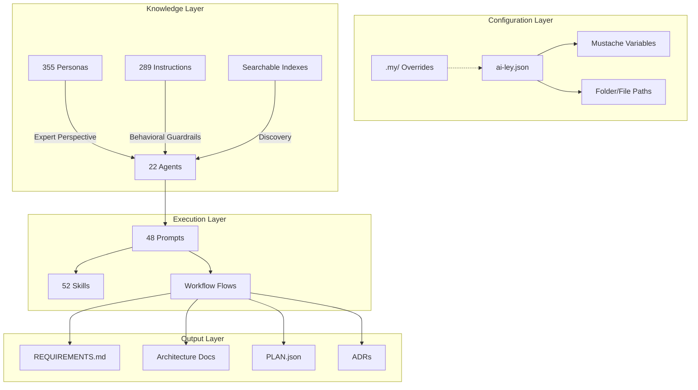

# AI-Powered Spec Development with the AI-ley Kit

## A 1-Hour Working Session

**Duration:** 60 minutes
**Format:** Presentation + Live Demos + Hands-On Exercises
**Audience:** Developers, Product Managers, Architects, Technical Leads
**Prerequisites:** VS Code with GitHub Copilot, ai-ley kit installed

---

## Agenda

| Time | Section | Format |
|------|---------|--------|
| 0:00–0:08 | 1. Why AI-Assisted Spec Development | Presentation |
| 0:08–0:18 | 2. The AI-ley Framework — Anatomy of a Spec Pipeline | Presentation + Demo |
| 0:18–0:30 | 3. Live Demo — From Idea to Requirements | Live Coding |
| 0:30–0:42 | 4. Live Demo — From Requirements to Architecture & Plan | Live Coding |
| 0:42–0:52 | 5. Hands-On Exercise — Build Your Own Spec | Guided Exercise |
| 0:52–0:58 | 6. Customization & Advanced Patterns | Presentation |
| 0:58–1:00 | 7. Wrap-Up & Resources | Q&A |

---

# Section 1: Why AI-Assisted Spec Development (8 min)

## The Problem

Spec development is the highest-leverage activity in software — and the most under-tooled.

**Common failure modes:**
- Requirements written in prose with no structure → ambiguous handoff to engineers
- Architecture decisions made in meetings with no traceable record
- Specs written once, never updated → drift from reality
- Context lost between stakeholders, architects, and developers
- Same boilerplate patterns re-invented per project

**The cost:**
- 56% of software defects originate in **requirements** (IBM Systems Sciences Institute)
- Fixing a requirements defect in production costs **100x** more than catching it during specification
- Teams spend 20-40% of development time on rework caused by ambiguous specs

## The AI-ley Approach

Instead of writing specs from scratch, compose them from **reusable, expert-informed building blocks**:

```
┌─────────────┐    ┌──────────────┐    ┌─────────────┐    ┌──────────┐
│   Intake     │───▶│ Requirements │───▶│Architecture │───▶│   Plan   │
│  (Ask/Ideas) │    │   (R-###)    │    │   (A-###)   │    │(Epic→    │
│              │    │              │    │   (I-###)    │    │ Story→   │
│              │    │              │    │   (ADRs)     │    │  Task)   │
└─────────────┘    └──────────────┘    └─────────────┘    └──────────┘
       ▲                  ▲                   ▲                 ▲
       │                  │                   │                 │
  ┌────┴────┐       ┌─────┴─────┐      ┌─────┴─────┐    ┌─────┴────┐
  │ Intakes │       │ Personas  │      │Instructions│    │  Schema  │
  │Templates│       │  (355)    │      │   (289)    │    │Validation│
  └─────────┘       └───────────┘      └───────────┘    └──────────┘
```

**Key insight:** AI agents don't just generate text — they apply **persona-driven expertise** and **instruction-set guardrails** to produce specs that follow proven patterns.

---

# Section 2: The AI-ley Framework — Anatomy of a Spec Pipeline (10 min)

## Framework Architecture



## The Six Primitives

Every spec development workflow in ai-ley is composed from six primitive types:

### 1. Personas — "Who is speaking?"

355 expert personas across 33 domains. Each persona brings a specific **perspective, vocabulary, and decision framework**.

**File:** `.github/ai-ley/personas/<domain>/<name>.md`

```yaml
---
name: Api Architect
description: Expert persona specializing in API design and architecture
keywords: [api, architecture, rest, graphql, microservices]
---
## Role Summary
System Architect specializing in API design, RESTful services,
GraphQL, and microservices integration.

## Goals & Responsibilities
- Design API architecture following best practices
- Define service boundaries and contracts
- Evaluate technology trade-offs

## Tools & Capabilities
- Frameworks: FastAPI, Express.js, Spring Boot, GraphQL
- Utilities: Postman, Swagger/OpenAPI, Docker, Kubernetes
```

**Why it matters for specs:** When you apply the `api-architect` persona to a requirements review, the AI thinks about rate limiting, versioning strategies, and contract-first design — things a generic AI would miss.

### 2. Instructions — "What rules to follow?"

289 instruction files that encode best practices, standards, and guardrails.

**File:** `.github/ai-ley/instructions/<category>/<name>.instructions.md`

```yaml
---
name: Planning.Instructions
description: Development guidelines for project planning and management
---
## Fundamental Concepts
1. Iterative Planning — Plans evolve with understanding
2. Evidence-Based Estimation
3. Risk-Driven Planning
4. Stakeholder Alignment
```

**Spec development instructions include:**
- `_general/planning.instructions.md` — Project planning methodology
- `_general/design.instructions.md` — Architecture & design principles
- `_general/documentation.instructions.md` — Documentation standards
- `business/business-plan.instructions.md` — Business specification patterns
- `_general/compliance.instructions.md` — Regulatory spec requirements

### 3. Agents — "Who orchestrates the work?"

22 specialized agents that combine personas, instructions, and tools into focused roles.

**File:** `.github/agents/<name>.agent.md`

```yaml
---
id: ailey-architect
name: AI-ley Architect
description: Software architecture specialist for design patterns,
  system design, and preventing anti-patterns
keywords: [architecture, design-patterns, system-design]
tools: [execute, read, edit, search, web, agent, todo]
---
# AI-ley Architect Agent

**Extends:** `ailey-orchestrator.agent.md`

## Role & Responsibilities
- Design pattern selection and application
- System architecture and scalability planning
- Anti-pattern identification and prevention
```

**Key agents for spec development:**

| Agent | Role in Spec Development |
|-------|--------------------------|
| `ailey-orchestrator` | Coordinates multi-step spec generation |
| `ailey-planner` | Breaks requirements into Epic→Story→Task |
| `ailey-architect` | Produces architecture docs, ADRs, C4 diagrams |
| `ailey-brainstorm` | Explores solution alternatives before committing |
| `ailey-documentation` | Generates and maintains spec docs |
| `ailey-security` | Reviews specs for security requirements |

### 4. Prompts — "What specific task to execute?"

48 reusable prompt templates that define specific spec generation workflows.

**File:** `.github/prompts/<name>.prompt.md`

**The spec development pipeline prompts:**

```
/intake           → Interactive project intake questionnaire
/build-requirements → Generate REQUIREMENTS.md from ASK/intake
/build-design     → Create system design document
/build-architecture → Produce architecture doc + ADRs
/build-plan       → Generate PLAN.json (Epic→Story→Task)
/build-test-plan  → Define test strategy from requirements
/scan-project     → Analyze existing project for spec gaps
```

### 5. Skills — "What integrations are available?"

52 skill modules providing external integrations (Jira, Confluence, Slack, etc.).

**Spec-relevant skills:**
- `ailey-atl-jira` — Sync PLAN.json ↔ Jira issues
- `ailey-atl-confluence` — Publish specs to Confluence
- `ailey-tools-model` — Generate Mermaid/PlantUML diagrams
- `ailey-tools-data-converter` — Convert between JSON/YAML/CSV formats

### 6. Intakes — "How to capture initial ideas?"

Interactive questionnaire templates that structure idea capture before spec generation.

**File:** `.github/ai-ley/intakes/<type>.md`

**Available intake templates:**
- `general.md` — Any project type
- `api.md` — API/microservices projects
- `web-app.md` — Web application projects
- `mobile.md` — Mobile application projects
- `ml-pipeline.md` — ML/data pipeline projects

---

# Section 3: Live Demo — From Idea to Requirements (12 min)

## Demo Scenario

We'll spec out a **Patient Appointment Scheduling API** for a healthcare system.

### Step 1: Project Intake (3 min)

Start with the API intake template:

```
/intake api
```

**Walk through key intake questions:**

- **Q1 API Name:** "Patient Scheduling Service"
- **Q2 Description:** "RESTful API for managing patient appointments across clinic locations, supporting booking, rescheduling, cancellation, waitlist, and provider availability"
- **Q4 API Type:** RESTful API, WebSocket API (real-time availability)
- **Q5 Authentication:** OAuth 2.0 + OpenID Connect, API Keys for partners

**What happens:** The intake responses are saved to `.project/INTAKE.md` — a structured document that feeds the requirements generator.

### Step 2: Draft the ASK Document (2 min)

If you prefer free-form capture over the intake questionnaire, write `.project/ASK.md`:

```markdown
# Patient Scheduling Service

## Problem
Patients currently call the front desk to schedule appointments.
Wait times average 8 minutes. 30% of calls are abandoned.
No self-service option exists.

## Goals
- Self-service booking via web and mobile
- Real-time provider availability
- Automated reminders (SMS + email)
- Waitlist management for cancellations
- Multi-location support (5 clinics)
- HIPAA compliance for all PHI

## Constraints
- Must integrate with existing Epic EHR system
- Go-live within 12 weeks
- Budget: $150K development + $2K/month hosting
```

### Step 3: Generate Requirements (5 min)

Run the requirements builder:

```
/build-requirements
```

**What the orchestrator does behind the scenes:**

1. Loads `.project/INTAKE.md` and/or `.project/ASK.md`
2. Selects relevant personas: `api-architect`, `solution-architect`, healthcare domain experts
3. Applies instructions: `planning.instructions.md`, `compliance.instructions.md`, `gdpr.instructions.md`
4. Uses chunking strategy for large specs (functional domain chunking)
5. Generates `REQUIREMENTS.md` with traceable requirement IDs (`R-001`, `R-002`, ...)

**Example output (`.project/REQUIREMENTS.md`):**

```markdown
# Patient Scheduling Service — Requirements Specification

## 1. Executive Summary
Self-service appointment scheduling API serving 5 clinic locations,
integrating with Epic EHR, supporting 50K monthly appointments.

## 2. Functional Requirements

### 2.1 Appointment Management
- **R-001**: System SHALL allow patients to book appointments via REST API
  - Acceptance: POST /appointments returns 201 with confirmation ID
  - Priority: HIGH
- **R-002**: System SHALL support appointment rescheduling within 24h policy
  - Acceptance: PUT /appointments/{id} with new time slot
  - Priority: HIGH
- **R-003**: System SHALL manage waitlist queue per provider per day
  - Acceptance: Waitlisted patients notified within 5 min of opening
  - Priority: MEDIUM

### 2.2 Provider Availability
- **R-010**: System SHALL expose real-time provider availability
  - Acceptance: WebSocket feed updates within 2s of schedule change
  - Priority: HIGH

### 2.3 Notifications
- **R-020**: System SHALL send appointment reminders 48h and 2h before
  - Acceptance: SMS + email delivery with confirmation tracking
  - Priority: HIGH

## 3. Non-Functional Requirements
- **NF-001**: API response time < 200ms at p95 under 500 concurrent users
- **NF-002**: System availability ≥ 99.9% (8.7h annual downtime max)
- **NF-003**: All PHI encrypted at rest (AES-256) and in transit (TLS 1.3)

## 4. Compliance Requirements
- **C-001**: HIPAA Privacy Rule — minimum necessary PHI access
- **C-002**: HIPAA Security Rule — audit logging for all PHI access
- **C-003**: HIPAA Breach Notification — automated incident detection
```

### Key Lesson: Persona-Driven Quality

**Without personas:** Generic requirements like "system should be secure" and "system should be fast."

**With personas (api-architect + compliance-expert):** Specific, measurable requirements with acceptance criteria, SLOs, and regulatory traceability.

---

# Section 4: Live Demo — From Requirements to Architecture & Plan (12 min)

## Step 4: Generate Architecture (5 min)

```
/build-architecture
```

**What the architect agent produces:**

1. **Architecture Document** at `.project/plan/architecture/architecture.md`
2. **ADR-0001** at `.project/plan/architecture/adrs/ADR-0001-architecture-direction.md`
3. **Updated REQUIREMENTS.md** with architecture component mappings

**Example output — Architecture Document:**

```markdown
# System Architecture — Patient Scheduling Service

## 1. Context & Goals (C4: Context)

Top 5 requirements this architecture optimizes for:
- R-001: Appointment booking (core workflow)
- R-010: Real-time availability (WebSocket feeds)
- NF-001: <200ms p95 response time
- NF-003: HIPAA-grade encryption
- C-002: Audit logging for PHI access

## 4. System Views

### 4.1 Context Diagram
```

````mermaid
flowchart LR
    Patient[Patient] -->|Book/Cancel/Reschedule| API[Scheduling API]
    Staff[Clinic Staff] -->|Manage Availability| API
    API -->|Read/Write| EHR[Epic EHR]
    API -->|Send Notifications| NOTIFY[Twilio/SendGrid]
    API -->|Stream Updates| WS[WebSocket Gateway]
````

```markdown
### 4.2 Container Diagram
```

````mermaid
graph TB
    subgraph "Client Layer"
        WEB[Web App] & MOB[Mobile App] & PARTNER[Partner API]
    end
    subgraph "API Layer"
        GW[API Gateway] --> AUTH[Auth Service]
        GW --> SCHED[Scheduling Service]
        GW --> AVAIL[Availability Service]
        GW --> WSOCKET[WebSocket Service]
    end
    subgraph "Data Layer"
        SCHED --> PG[(PostgreSQL)]
        AVAIL --> REDIS[(Redis Cache)]
        SCHED --> KAFKA[Event Bus]
    end
    subgraph "External"
        AUTH --> OKTA[Okta/OAuth]
        SCHED --> EHR[Epic FHIR API]
        KAFKA --> NOTIFY[Notification Service]
    end
````

**Example output — ADR:**

```markdown
# ADR-0001: Architecture Direction

## Status: Accepted
## Date: 2026-04-04

## Context
Patient scheduling requires sub-200ms response times, real-time
availability updates, HIPAA compliance, and Epic EHR integration.

## Decision
Adopt a microservices architecture with:
- Event-driven communication via Kafka
- Redis-backed availability cache (invalidated on schedule changes)
- PostgreSQL for appointment state (ACID guarantees)
- WebSocket gateway for real-time client feeds

## Consequences
- (+) Independent scaling of scheduling vs. availability services
- (+) Redis cache enables <50ms availability lookups
- (-) Operational complexity of 4 services vs. monolith
- (-) Eventual consistency between cache and DB (mitigated by 2s TTL)
```

## Step 5: Generate Project Plan (5 min)

```
/build-plan
```

**What the planner agent produces:**

`.project/PLAN.json` with traceable mappings back to requirements:

```json
{
  "version": "1.0.0",
  "items": [
    {
      "id": "E-001",
      "type": "epic",
      "name": "Core Scheduling API",
      "description": "Implement appointment CRUD operations",
      "status": "BACKLOG",
      "requirements": ["R-001", "R-002", "R-003"],
      "children": [
        {
          "id": "S-001",
          "type": "story",
          "name": "As a patient, I can book an appointment",
          "requirements": ["R-001"],
          "acceptanceCriteria": [
            "POST /appointments returns 201",
            "Confirmation ID in response body",
            "Appointment visible in Epic EHR within 30s"
          ],
          "children": [
            { "id": "T-001", "type": "task", "name": "Design appointment booking endpoint schema" },
            { "id": "T-002", "type": "task", "name": "Implement POST /appointments handler" },
            { "id": "T-003", "type": "task", "name": "Write Epic FHIR integration for appointment sync" },
            { "id": "T-004", "type": "task", "name": "Add appointment confirmation notification trigger" }
          ]
        }
      ]
    }
  ]
}
```

### Key Lesson: Traceability Chain

Every artifact links back to its source:

```
ASK.md → R-001 (Requirement) → A-003 (Architecture Component)
       → E-001 (Epic) → S-001 (Story) → T-001..T-004 (Tasks)
       → ADR-0001 (Decision Record)
```

**Nothing is orphaned.** Every task traces to a story, every story to a requirement, every requirement to a stakeholder need.

## Step 6: Sync to Jira (2 min)

```
/jira-sync
```

Using the `ailey-atl-jira` skill, the PLAN.json items are pushed to Jira as issues with:
- Epic → Jira Epic
- Story → Jira Story (linked to Epic)
- Task → Jira Sub-task (linked to Story)
- Requirement IDs preserved in custom fields

---

# Section 5: Hands-On Exercise — Build Your Own Spec (10 min)

## Exercise: Specify a Feature in 10 Minutes

**Choose one scenario** (or bring your own):

### Option A: E-Commerce Product Search API
> Build a product search service supporting full-text search, faceted filtering, price ranges, and real-time inventory status across 3 warehouses.

### Option B: Team Collaboration Notification System
> Design a notification service handling in-app, email, SMS, and push notifications with user preference management, batching, and do-not-disturb schedules.

### Option C: IoT Device Fleet Manager
> Specify a management API for 10,000 ESP32 devices handling firmware OTA updates, health monitoring, configuration provisioning, and alerting.

## Steps

1. **Create your ASK document** (2 min)
   ```
   Create .project/ASK.md with your scenario description,
   goals, constraints, and key requirements
   ```

2. **Run the intake** (1 min)
   ```
   /intake general
   ```
   Answer the top 5 questions for your scenario.

3. **Generate requirements** (3 min)
   ```
   /build-requirements
   ```
   Review the output. Note the requirement IDs and acceptance criteria.

4. **Generate architecture** (3 min)
   ```
   /build-architecture
   ```
   Review the C4 diagrams and the ADR.

5. **Review and discuss** (1 min)
   - What did the AI get right?
   - What's missing?
   - How would you refine the personas/instructions to improve output?

---

# Section 6: Customization & Advanced Patterns (10 min)

## Pattern 1: Custom Personas for Your Domain

If the 355 built-in personas don't cover your domain, create your own:

**File:** `.github/ai-ley/personas/healthcare/hipaa-compliance-officer.md`

```yaml
---
name: HIPAA Compliance Officer
description: Healthcare compliance expert specializing in HIPAA regulations
keywords: [hipaa, phi, compliance, healthcare, audit, privacy]
---
## Role Summary
Compliance officer with expertise in HIPAA Privacy Rule, Security Rule,
and Breach Notification Rule for healthcare IT systems.

## Perspective & Approach
- Every data element is evaluated: "Is this PHI?"
- Default to minimum necessary access principle
- Require audit trails for all PHI access paths
- Demand BAA documentation for all third-party services

## Decision Framework
1. Does this feature access, store, or transmit PHI?
2. Is the minimum necessary standard applied?
3. Are audit controls in place?
4. Is encryption at rest AND in transit?
5. Does the BAA with the vendor cover this use case?
```

**Impact:** When this persona is active during `/build-requirements`, every requirement is evaluated through HIPAA compliance lens — generating compliance requirements you'd otherwise miss.

## Pattern 2: The `.my/` Override System

Personal overrides that take precedence over shared kit resources:

```
.my/
├── ai-ley/
│   ├── ai-ley.json          ← Override paths and variables
│   ├── personas/             ← Your custom personas
│   │   └── healthcare/
│   │       └── hipaa-officer.md
│   └── instructions/         ← Your custom instructions
│       └── compliance/
│           └── hipaa-checklist.instructions.md
└── aicc/
    └── tasks.json            ← Your scheduled automation
```

**Priority system:**
- 0–49: Default kit instructions
- 50–99: Project-level instructions
- 100–149: Team-level overrides
- 150+: Personal `.my/` overrides (**highest priority**)

## Pattern 3: Composing Multi-Agent Spec Reviews

Use the orchestrator to run a **spec review panel**:

```markdown
## Spec Review Request

Review .project/REQUIREMENTS.md from these perspectives:

1. **Architect** (ailey-architect): Are the requirements implementable?
   Flag any that conflict with architectural constraints.

2. **Security** (ailey-security): Run OWASP Top 10 analysis against
   each requirement. Flag gaps.

3. **Tester** (ailey-tester): Can each requirement be tested?
   Flag any that lack measurable acceptance criteria.

4. **Brainstorm** (ailey-brainstorm): What alternative approaches
   exist for the top 3 highest-risk requirements?
```

The orchestrator decomposes this into sub-agent invocations, collects results, and synthesizes a consolidated review report.

## Pattern 4: Evolve Specs Over Time

The `build-project` flow defines a full lifecycle:

```
/intake → /build-requirements → /grow-learn → /grow-evolve
    → /build-design → /build-architecture → /grow-evolve
    → /build-plan → /grow-evolve → /grow-innovate
    → /run → /build-test-plan → /document
```

At each `/grow-evolve` step, the AI:
- Reads current project state
- Compares against requirements
- Identifies gaps, conflicts, and improvements
- Updates artifacts in place

**Specs are living documents** — not static outputs.

## Pattern 5: Schema-Validated Plans

PLAN.json is validated against `.github/aicc/schemas/plan.v1.schema.json`.

This means:
- Every plan item has required fields (id, type, name, status)
- Status follows defined workflow: `BACKLOG → READY → IN-PROGRESS → REVIEW → DONE`
- Bidirectional sync with Jira preserves structure
- The VS Code planning panel renders the plan as an interactive tree

---

# Section 7: Wrap-Up & Resources (2 min)

## Key Takeaways

1. **Spec development is a pipeline, not a document** — intake → requirements → architecture → plan, each feeding the next
2. **Personas drive quality** — 355 expert perspectives catch domain-specific concerns a generic AI misses
3. **Instructions enforce standards** — 289 behavioral guardrails prevent common spec anti-patterns
4. **Traceability is built in** — every task traces to a story, every story to a requirement, every requirement to a stakeholder need
5. **Specs evolve** — the grow/evolve cycle keeps specs aligned with reality as projects progress
6. **Customization is layered** — `.my/` overrides let you add domain expertise without modifying the shared kit

## Quick Reference

| What You Want | Command |
|---------------|---------|
| Start a new project spec | `/intake <type>` |
| Generate requirements | `/build-requirements` |
| Create design doc | `/build-design` |
| Create architecture + ADRs | `/build-architecture` |
| Generate project plan | `/build-plan` |
| Scan existing project | `/scan-project` |
| Evolve current specs | `/grow-evolve` |
| Innovation analysis | `/grow-innovate` |
| Multi-perspective review | Use orchestrator with multiple agents |

## Resources

- **Framework docs:** `docs/AI_LEY_FRAMEWORK.md`
- **Quick start:** `docs/QUICK_START.md`
- **Configuration:** `docs/CONFIGURATION.md`
- **Indexes:** `.github/ai-ley/indexes/` (instructions, personas, prompts)
- **Templates:** `.github/ai-ley/templates/` (agent, persona, prompt, instruction)
- **Build flow:** `.github/ai-ley/flows/build-project.flow.puml`

---

## Appendix A: Spec Development Resource Map

```
.github/
├── agents/                          # 22 specialized agents
│   ├── ailey-orchestrator.agent.md  # Central coordinator
│   ├── ailey-architect.agent.md     # Architecture specialist
│   ├── ailey-planner.agent.md       # Planning specialist
│   ├── ailey-security.agent.md      # Security reviewer
│   └── ailey-tester.agent.md        # Testability reviewer
├── prompts/                         # 48 reusable prompts
│   ├── ailey-build-requirements.prompt.md
│   ├── ailey-build-architecture.prompt.md
│   ├── ailey-build-plan.prompt.md
│   ├── ailey-build-design.prompt.md
│   └── ailey-build-test-plan.prompt.md
├── ai-ley/
│   ├── ai-ley.json                  # Master configuration
│   ├── intakes/                     # 5 intake templates
│   ├── personas/                    # 355 expert personas
│   ├── instructions/                # 289 instruction sets
│   ├── indexes/                     # Searchable indexes
│   ├── templates/                   # File templates
│   └── flows/                       # Workflow definitions
└── skills/                          # 52 integration skills
    ├── ailey-atl-jira/              # Jira sync
    ├── ailey-atl-confluence/        # Confluence publishing
    └── ailey-tools-model/           # Diagram generation

.project/                            # Project artifacts (output)
├── ASK.md                           # Raw ideas and requests
├── INTAKE.md                        # Structured intake responses
├── REQUIREMENTS.md                  # Generated requirements (R-###)
├── PLAN.json                        # Epic→Story→Task plan
├── SUGGESTIONS.md                   # Enhancement ideas
├── BUGS.md                          # Known issues
└── plan/
    └── architecture/
        ├── architecture.md          # Architecture document
        ├── design.md                # Design document
        └── adrs/                    # Architecture Decision Records
```

## Appendix B: Presenter Notes

### Section 1 (8 min)
- Open with the IBM stat about requirements defects — it resonates with every audience
- Emphasize the "compose, don't write" mental model
- Show the pipeline diagram — this is the conceptual anchor for the entire session

### Section 3 (12 min)
- Have the demo project pre-staged with an empty `.project/` directory
- Run `/intake api` live — type answers quickly, you only need 4-5 questions
- Run `/build-requirements` and let it run — narrate what the orchestrator is doing while it generates
- Highlight the requirement IDs, acceptance criteria, and compliance section
- Point out persona influence: "This HIPAA section? That came from the compliance-expert persona."

### Section 4 (12 min)
- Run `/build-architecture` on the already-generated requirements
- Focus on the C4 diagrams and the ADR — these are the high-value outputs
- Show the traceability: click through R-001 → A-003 → E-001 → S-001 → T-001
- Run `/build-plan` and show the JSON output, then open the VS Code planning panel

### Section 5 (10 min)
- Give participants 2 minutes to write their ASK.md — stress "imperfect is fine"
- Walk the room while they run the prompts
- Common questions: "How do I add my own personas?" → Preview Section 6

### Section 6 (10 min)
- Show creating a custom persona file live (copy the template, fill in 3 sections)
- Demonstrate the `.my/` override — "this is your personal toolbox"
- The multi-agent review pattern is the advanced takeaway — it's what separates basic use from expert use

---

*Presentation created: April 2026 | AI-ley Kit v1.0*
*For the AI-ley framework by AI Command Center*
